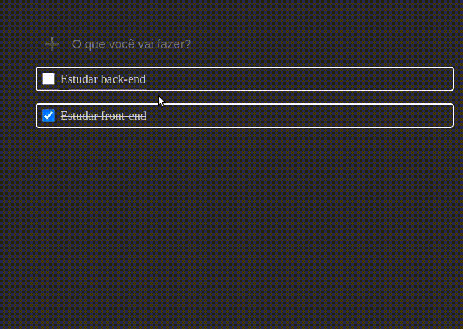

## Todo List - Lista de Tarefas

### Sobre

O projeto é baseado em uma série de tarefas que serão escolhidas pelo usuário ao longo do seu dia ou atividades que possam ser pendentes durante seu dia.

A lista de tarefas tem um campo digitável onde será o gerenciador de atividades postadas na tela, em cada inserção, será apresentado sua atividade escolhida.


- Campo Digitável (O que você vai fazer?) - Lugar onde o usuário vai escolher sua tarefa realizada no dia.
- Blocos de tarefas - A cada tarefa digitada o React vai desenvolver um novo bloco, inserido a tarefa digitada.

### Escopo do projeto

O escopo do projeto foi dividido em componentes, existem 2 componentes gerais, sendo eles: **Input e Bloco**. Existindo um componente principal, onde assegura todos os dentro da página.

#### Input


##### Arquivos relacionados

- [x] pages/index.tsx
- [x] addLista/AddLista.tsx

#### Bloco de tarefas


##### Arquivos relacionados

- [x] pages/index.tsx
- [x] addLista/AddLista.tsx 

### O que foi utilizado dentro do Projeto?

#### Styled-Components

Ferramenta utilizada para simplificar o estilo dentro da aplicação, não permitindo a repetição dos meus códigos com relação ao seu designer.


#### React Router DOM

Ferramenta utilizada para gerenciar as rotas dentro do meu App. Não sendo algo necessário dentro da aplicação, estudei a aplicação da exportação de componentes dentro do novo universo do react-router-dom


```bash
    # styled-components
    npm install styled-components
    npm install -D @types/styled-components

    # react-router-dom
    npm install react-router-dom
    npm install -D @types/react-router-dom
```

### Funcionalidade do Projeto



- A cada **Enter** o texto é deletado para que o usuário não precise deletar todos as letras.
- O usuário poderá selecionar a tarefa cumprida ao decorrer do seu dia, ou seja, quando cumprir uma tarefa ele clique na caixa ao lado. Logo será riscado.

### Como executar o projeto?

Como qualquer projeto React ele é introduzido através do pacote gerenciador que armazena os módulos utilizados na lib. Sendo gerado através de um arquivo package.json

**Executado o projeto**

```bash
# Clone este repositório
$ git clone https://github.com/MateusMaciel340/todo-list.git

# Acesse a pasta do projeto no terminal/cmd - React
$ cd todo-list/

# Acessando os arquivos - (VSCode)
$ code .

# Instalação das dependências
npm install
```

### Desenvolvedor


Mateus Sousa - <b>Desenvolvedor</b>


### Licença

Este projeto está sobre a licença do [MIT](https://github.com/facebook/react/blob/main/LICENSE)
